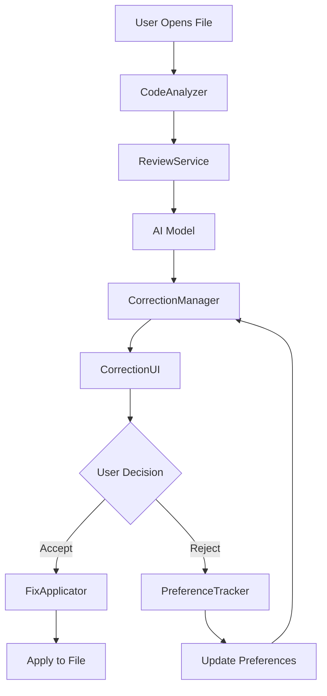
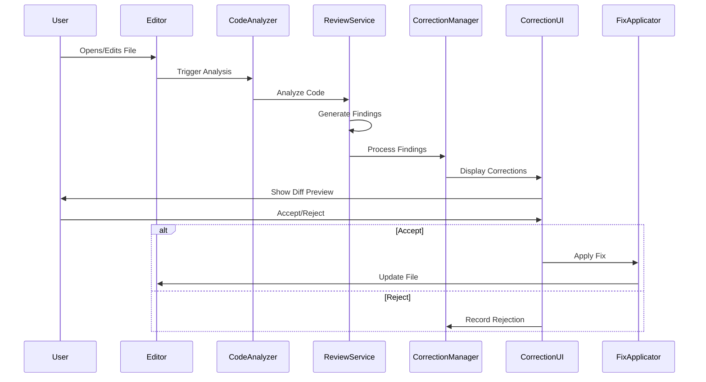

# Design Document: AI Code Correction Feature

## Overview

This design document outlines the implementation of an AI-powered code correction feature that extends the existing review system in Orbit. The feature will automatically analyze code files, detect errors, generate correction suggestions, and provide an interactive approval flow for applying fixes. This builds upon the existing `ReviewService`, `ReviewCommand`, and related infrastructure while adding new components for interactive fix management and application.

The key enhancement is transforming the passive review system into an active correction system where users can:
1. See errors highlighted in real-time
2. Preview suggested fixes with diff views
3. Accept or reject corrections individually or in bulk
4. Apply approved changes directly to files

## Architecture

The feature extends the existing review architecture with new interactive components:



### Component Interaction Flow



## Components and Interfaces

### 1. CodeAnalyzer (New)

Orchestrates automatic code analysis on file events.

```typescript
interface AnalysisResult {
  findings: Finding[];
  corrections: CorrectionSuggestion[];
  timestamp: number;
}

interface AnalysisTrigger {
  type: 'open' | 'save' | 'manual' | 'scheduled';
  scope: 'file' | 'selection' | 'workspace';
}

class CodeAnalyzer {
  private reviewService: ReviewService;
  private correctionManager: CorrectionManager;
  private analysisCache: Map<string, AnalysisResult>;
  
  /**
   * Analyze code and generate corrections
   */
  async analyzeCode(
    document: vscode.TextDocument,
    trigger: AnalysisTrigger
  ): Promise<AnalysisResult>;
  
  /**
   * Register file event listeners
   */
  registerListeners(context: vscode.ExtensionContext): void;
  
  /**
   * Clear analysis cache for file
   */
  clearCache(fileUri: vscode.Uri): void;
  
  /**
   * Get cached analysis result
   */
  getCachedResult(fileUri: vscode.Uri): AnalysisResult | null;
}
```

### 2. CorrectionSuggestion (New Type)

Extends Finding with correction-specific metadata.

```typescript
interface CorrectionSuggestion extends Finding {
  correctionId: string;
  status: CorrectionStatus;
  diffPreview: DiffPreview;
  confidence: number;        // 0-1 score from AI
  applicability: boolean;    // Can this be auto-applied?
  dependencies: string[];    // Other correction IDs this depends on
}

enum CorrectionStatus {
  Pending = 'pending',
  Accepted = 'accepted',
  Rejected = 'rejected',
  Applied = 'applied',
  Failed = 'failed'
}

interface DiffPreview {
  original: string;
  modified: string;
  unified: string;          // Unified diff format
  startLine: number;
  endLine: number;
}
```

### 3. CorrectionManager (New)

Manages correction lifecycle, preferences, and bulk operations.

```typescript
interface CorrectionPreferences {
  rejectedPatterns: RejectionPattern[];
  acceptedPatterns: AcceptancePattern[];
  categoryPreferences: Record<FindingCategory, PreferenceWeight>;
}

interface RejectionPattern {
  pattern: string;
  category: FindingCategory;
  count: number;
  lastRejected: number;
}

interface PreferenceWeight {
  autoAccept: boolean;
  weight: number;           // 0-1, higher = more preferred
}

class CorrectionManager {
  private corrections: Map<string, CorrectionSuggestion>;
  private preferences: CorrectionPreferences;
  private preferenceTracker: PreferenceTracker;
  
  /**
   * Add corrections from analysis
   */
  addCorrections(corrections: CorrectionSuggestion[]): void;
  
  /**
   * Get corrections for file
   */
  getCorrectionsForFile(fileUri: vscode.Uri): CorrectionSuggestion[];
  
  /**
   * Update correction status
   */
  updateStatus(correctionId: string, status: CorrectionStatus): void;
  
  /**
   * Get all pending corrections
   */
  getPendingCorrections(): CorrectionSuggestion[];
  
  /**
   * Filter corrections by preferences
   */
  filterByPreferences(corrections: CorrectionSuggestion[]): CorrectionSuggestion[];
  
  /**
   * Resolve correction dependencies
   */
  resolveDependencies(correctionIds: string[]): string[];
}
```

### 4. CorrectionUI (New)

Provides UI components for displaying and interacting with corrections.

```typescript
interface CorrectionQuickPick extends vscode.QuickPickItem {
  correction: CorrectionSuggestion;
  preview: string;
}

interface CorrectionCodeLens extends vscode.CodeLens {
  correctionId: string;
  action: 'accept' | 'reject' | 'preview';
}

class CorrectionUI {
  private decorationType: vscode.TextEditorDecorationType;
  private codeLensProvider: CorrectionCodeLensProvider;
  
  /**
   * Show diff preview for correction
   */
  async showDiffPreview(correction: CorrectionSuggestion): Promise<void>;
  
  /**
   * Show correction quick pick list
   */
  async showCorrectionList(
    corrections: CorrectionSuggestion[]
  ): Promise<CorrectionSuggestion | undefined>;
  
  /**
   * Show bulk correction confirmation
   */
  async showBulkConfirmation(
    corrections: CorrectionSuggestion[]
  ): Promise<boolean>;
  
  /**
   * Add inline decorations for corrections
   */
  addDecorations(
    editor: vscode.TextEditor,
    corrections: CorrectionSuggestion[]
  ): void;
  
  /**
   * Show hover preview
   */
  provideHover(
    document: vscode.TextDocument,
    position: vscode.Position
  ): vscode.ProviderResult<vscode.Hover>;
}
```

### 5. FixApplicator (Enhanced)

Extends existing FixApplicator with conflict resolution and undo support.

```typescript
interface ApplyResult {
  success: boolean;
  correctionId: string;
  error?: string;
  conflictsWith?: string[];
}

interface ApplyOptions {
  preserveFormatting: boolean;
  createBackup: boolean;
  resolveConflicts: 'skip' | 'merge' | 'ask';
}

class FixApplicator {
  /**
   * Apply single correction to file
   */
  async applySingleFix(
    correction: CorrectionSuggestion,
    options?: ApplyOptions
  ): Promise<ApplyResult>;
  
  /**
   * Apply multiple corrections in order
   */
  async applyMultipleFixes(
    corrections: CorrectionSuggestion[],
    options?: ApplyOptions
  ): Promise<ApplyResult[]>;
  
  /**
   * Check for conflicts between corrections
   */
  detectConflicts(corrections: CorrectionSuggestion[]): string[][];
  
  /**
   * Create workspace edit for correction
   */
  createEdit(correction: CorrectionSuggestion): vscode.WorkspaceEdit;
  
  /**
   * Validate correction before applying
   */
  async validateCorrection(correction: CorrectionSuggestion): Promise<boolean>;
}
```

### 6. PreferenceTracker (New)

Tracks user preferences and learns from accept/reject patterns.

```typescript
interface PreferenceData {
  correctionId: string;
  action: 'accept' | 'reject';
  category: FindingCategory;
  pattern: string;
  timestamp: number;
}

class PreferenceTracker {
  private history: PreferenceData[];
  private storage: vscode.Memento;
  
  /**
   * Record user action
   */
  recordAction(
    correction: CorrectionSuggestion,
    action: 'accept' | 'reject'
  ): void;
  
  /**
   * Get preference weight for correction
   */
  getPreferenceWeight(correction: CorrectionSuggestion): number;
  
  /**
   * Check if correction matches rejected pattern
   */
  matchesRejectedPattern(correction: CorrectionSuggestion): boolean;
  
  /**
   * Export preferences
   */
  exportPreferences(): CorrectionPreferences;
  
  /**
   * Reset all preferences
   */
  resetPreferences(): void;
}
```

### 7. CorrectionPanel (New Webview)

Provides a dedicated panel for managing corrections across the workspace.

```typescript
interface PanelState {
  corrections: CorrectionSuggestion[];
  filters: {
    severity: SeverityLevel[];
    category: FindingCategory[];
    status: CorrectionStatus[];
  };
  groupBy: 'file' | 'severity' | 'category';
  sortBy: 'severity' | 'file' | 'confidence';
}

class CorrectionPanel implements vscode.WebviewViewProvider {
  /**
   * Update panel with new corrections
   */
  updateCorrections(corrections: CorrectionSuggestion[]): void;
  
  /**
   * Handle user actions from panel
   */
  handleAction(action: PanelAction): Promise<void>;
  
  /**
   * Refresh panel state
   */
  refresh(): void;
}
```

## Data Models

### Correction Workflow States

```typescript
enum WorkflowState {
  Analyzing = 'analyzing',
  Ready = 'ready',
  Previewing = 'previewing',
  Applying = 'applying',
  Complete = 'complete',
  Error = 'error'
}

interface CorrectionWorkflow {
  state: WorkflowState;
  corrections: CorrectionSuggestion[];
  progress: number;
  error?: string;
}
```

### Message Protocol for Webview

```typescript
// Extension -> Webview
type ExtensionMessage =
  | { type: 'correctionsUpdated'; corrections: CorrectionSuggestion[] }
  | { type: 'correctionApplied'; correctionId: string; success: boolean }
  | { type: 'analysisProgress'; progress: number; message: string }
  | { type: 'preferencesUpdated'; preferences: CorrectionPreferences };

// Webview -> Extension
type WebviewMessage =
  | { type: 'acceptCorrection'; correctionId: string }
  | { type: 'rejectCorrection'; correctionId: string }
  | { type: 'previewCorrection'; correctionId: string }
  | { type: 'applyBulk'; correctionIds: string[] }
  | { type: 'filterChanged'; filters: PanelState['filters'] };
```

## 
Correctness Properties

*A property is a characteristic or behavior that should hold true across all valid executions of a system—essentially, a formal statement about what the system should do. Properties serve as the bridge between human-readable specifications and machine-verifiable correctness guarantees.*

After analyzing the acceptance criteria, we've identified the following correctness properties that can be validated through property-based testing.

### Property 1: Analysis triggers on file events
*For any* file open or save event, the system should trigger code analysis and generate findings.
**Validates: Requirements 1.1, 1.2**

### Property 2: Error severity ordering
*For any* set of detected errors, when displayed or processed, they should be ordered by severity (critical > warning > info > suggestion).
**Validates: Requirements 1.5**

### Property 3: Visual indicators for errors
*For any* file with detected errors, visual indicators should be displayed in the editor at the correct line numbers.
**Validates: Requirements 1.3**

### Property 4: Correction generation completeness
*For any* detected error, the system should generate at least one correction suggestion.
**Validates: Requirements 2.1, 2.4**

### Property 5: Correction structure completeness
*For any* correction suggestion, it should include original code, proposed fix, and explanation (all non-empty).
**Validates: Requirements 2.2, 2.3**

### Property 6: Diff view generation
*For any* correction suggestion, a diff view should be generated showing the exact changes.
**Validates: Requirements 3.1, 3.2**

### Property 7: Hover preview availability
*For any* error indicator in the editor, hovering should display a correction preview.
**Validates: Requirements 3.4**

### Property 8: Correction application accuracy
*For any* accepted correction, applying it should result in the file containing the exact proposed fix code.
**Validates: Requirements 4.1**

### Property 9: Formatting preservation
*For any* file with specific formatting (indentation, line endings), applying corrections should preserve the formatting style.
**Validates: Requirements 4.2**

### Property 10: Undo support
*For any* applied correction, performing undo should restore the file to its exact state before the correction.
**Validates: Requirements 4.3**

### Property 11: Correction ordering with dependencies
*For any* set of corrections with dependencies, applying them should respect the dependency order.
**Validates: Requirements 4.4**

### Property 12: Conflict detection
*For any* set of corrections affecting overlapping line ranges, the system should detect and report conflicts.
**Validates: Requirements 4.5**

### Property 13: Analysis progress indication
*For any* triggered analysis operation, progress indication should be displayed and updated.
**Validates: Requirements 5.4**

### Property 14: Analysis cancellation
*For any* ongoing analysis, cancellation should stop the analysis and clean up resources.
**Validates: Requirements 5.5**

### Property 15: Issue grouping correctness
*For any* set of issues in the panel, grouping by file or severity should result in correct groups with all issues in the right group.
**Validates: Requirements 6.2**

### Property 16: Correction count accuracy
*For any* issue displayed in the panel, the shown correction count should match the actual number of available corrections.
**Validates: Requirements 6.3**

### Property 17: Navigation accuracy
*For any* issue clicked in the panel, the editor should navigate to the exact file and line number of the issue.
**Validates: Requirements 6.4**

### Property 18: Panel filtering correctness
*For any* filter applied (severity, file type, correction availability), all displayed issues should match the filter criteria.
**Validates: Requirements 6.5**

### Property 19: Bulk confirmation completeness
*For any* bulk fix operation, the confirmation dialog should list all files and corrections that will be applied.
**Validates: Requirements 7.3, 7.4**

### Property 20: Bulk deselection support
*For any* bulk fix operation, deselecting specific corrections should exclude them from application.
**Validates: Requirements 7.5**

### Property 21: Rejection pattern recording
*For any* rejected correction, the system should record the rejection pattern and it should be retrievable.
**Validates: Requirements 8.1**

### Property 22: Acceptance pattern recording
*For any* accepted correction, the system should record the acceptance pattern and it should be retrievable.
**Validates: Requirements 8.2**

### Property 23: Preference-based ranking
*For any* set of corrections, after building preference history, corrections matching accepted patterns should rank higher than those matching rejected patterns.
**Validates: Requirements 8.3**

### Property 24: Rejected pattern filtering
*For any* correction matching a previously rejected pattern, it should not appear in future suggestions (unless preferences are reset).
**Validates: Requirements 8.4**

### Property 25: Preference reset
*For any* preference history, after reset, all preferences should be cleared and ranking should return to default.
**Validates: Requirements 8.5**

### Property 26: Style matching
*For any* file with consistent style (e.g., 2-space indentation), generated corrections should match that style.
**Validates: Requirements 9.2**

### Property 27: Import awareness
*For any* correction that references functions or modules, those references should exist in the file's imports or be built-in.
**Validates: Requirements 9.3**

### Property 28: No new errors from corrections
*For any* applied correction, re-analyzing the file should not introduce new errors in the corrected section.
**Validates: Requirements 9.5**

### Property 29: Category filtering
*For any* category disabled in settings, corrections of that category should not be suggested.
**Validates: Requirements 10.1**

### Property 30: Severity threshold filtering
*For any* minimum severity level set, only corrections at or above that severity should be suggested.
**Validates: Requirements 10.3**

### Property 31: File exclusion
*For any* file or directory excluded in settings, analysis should not be triggered for files in those paths.
**Validates: Requirements 10.4**

## Error Handling

### Analysis Errors

1. **AI Model Unavailable**: When the AI model cannot be reached
   - Display error notification
   - Fall back to static analysis only
   - Retry with exponential backoff

2. **Analysis Timeout**: When analysis takes too long
   - Cancel analysis after timeout
   - Show partial results if available
   - Allow user to retry with extended timeout

3. **Parse Errors**: When code cannot be parsed
   - Report parse error as a finding
   - Skip correction generation for unparseable code
   - Suggest syntax fixes if possible

### Application Errors

1. **File Modified During Application**: When file changes while applying correction
   - Detect modification timestamp change
   - Show warning and offer to reapply
   - Preserve user's changes

2. **Permission Errors**: When file cannot be written
   - Display permission error
   - Suggest checking file permissions
   - Offer to copy correction to clipboard

3. **Conflict Resolution Failures**: When corrections conflict
   - Show conflict details
   - Offer manual resolution
   - Allow applying non-conflicting corrections

### Preference Errors

1. **Storage Failures**: When preferences cannot be saved
   - Log error
   - Continue with in-memory preferences
   - Retry save on next action

## Testing Strategy

### Unit Testing

Unit tests will cover specific scenarios and edge cases:

- Correction generation for specific error types (syntax, logical, style)
- Diff generation for various code changes
- Conflict detection for overlapping corrections
- Preference tracking for specific patterns
- UI component rendering with specific correction states
- File application with various formatting styles
- Navigation to specific line numbers
- Filter logic for specific criteria

### Property-Based Testing

We will use the `fast-check` library for property-based testing. Each correctness property will be implemented as a property-based test:

- **Minimum iterations**: 100 runs per property test
- **Test tagging**: Each test must include a comment with format: `**Feature: ai-code-correction, Property {number}: {property_text}**`
- **Generators**: Custom generators for code snippets, errors, corrections, preferences
- **Shrinking**: Leverage fast-check's shrinking to find minimal failing cases

Example property test structure:

```typescript
/**
 * Feature: ai-code-correction, Property 8: Correction application accuracy
 * Validates: Requirements 4.1
 */
test('correction application accuracy', async () => {
  await fc.assert(
    fc.asyncProperty(
      codeSnippetGenerator(),
      correctionGenerator(),
      async (code, correction) => {
        const file = await createTestFile(code);
        await applicator.applySingleFix(correction);
        const result = await readFile(file);
        return result.includes(correction.suggestedFix.code);
      }
    ),
    { numRuns: 100 }
  );
});
```

### Integration Testing

Integration tests will verify end-to-end workflows:

- User opens file → analysis runs → corrections displayed → user accepts → file updated
- User triggers bulk fix → confirmation shown → corrections applied → undo works
- User rejects correction → preference recorded → similar corrections filtered
- User changes settings → analysis behavior changes accordingly

## Implementation Phases

### Phase 1: Core Analysis and Correction Generation
- Implement CodeAnalyzer with file event listeners
- Extend ReviewService to generate correction suggestions
- Create CorrectionManager for lifecycle management
- Add basic error handling

### Phase 2: Interactive UI Components
- Implement CorrectionUI with diff previews
- Add CodeLens for inline accept/reject actions
- Create hover provider for correction previews
- Implement decoration for error indicators

### Phase 3: Correction Application
- Enhance FixApplicator with conflict detection
- Implement workspace edit creation
- Add undo support
- Handle formatting preservation

### Phase 4: Preference Learning
- Implement PreferenceTracker
- Add pattern matching for rejections
- Implement ranking based on preferences
- Add preference reset functionality

### Phase 5: Bulk Operations and Panel
- Create CorrectionPanel webview
- Implement bulk fix actions
- Add confirmation dialogs
- Implement filtering and grouping

### Phase 6: Configuration and Polish
- Add settings for category filtering
- Implement severity threshold
- Add file exclusion patterns
- Create preset configurations

## Performance Considerations

1. **Debounced Analysis**: Debounce analysis triggers to avoid excessive AI calls during rapid typing
2. **Incremental Analysis**: Only re-analyze changed sections when possible
3. **Caching**: Cache analysis results and invalidate on file changes
4. **Lazy Loading**: Load corrections on-demand rather than all at once
5. **Background Processing**: Run analysis in background to avoid blocking UI
6. **Batch Processing**: Batch multiple corrections for bulk operations

## Security Considerations

1. **Code Injection**: Validate all AI-generated code before application
2. **File System Access**: Validate all file paths to prevent directory traversal
3. **Preference Storage**: Sanitize preference data before storage
4. **AI Prompt Injection**: Sanitize user code before sending to AI model
5. **Resource Limits**: Limit analysis scope to prevent resource exhaustion

## Accessibility

1. **Screen Reader Support**: Announce corrections and their status
2. **Keyboard Navigation**: Full keyboard support for all correction actions
3. **High Contrast**: Ensure decorations are visible in all themes
4. **Focus Management**: Proper focus handling in dialogs and panels
5. **Status Announcements**: Announce analysis progress and completion
