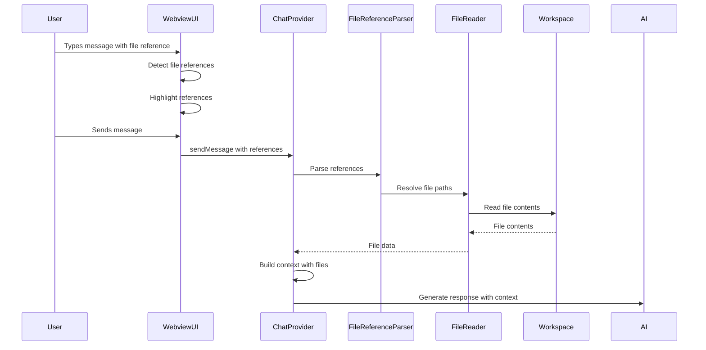

# Design Document: Direct File Reading Feature

## Overview

This design document outlines the implementation of direct file reading capabilities for the Orbit VS Code extension. The feature enables users to explicitly reference files in chat conversations, providing better context control and more accurate AI responses. The implementation extends the existing ChatProvider and webview UI with file reference detection, validation, and content injection into the chat context.

## Architecture

The feature follows a client-server architecture pattern consistent with the existing extension:

1. **Webview UI Layer** (React): Handles user interactions, file reference input, and visual feedback
2. **Extension Host Layer** (TypeScript): Processes file references, validates paths, reads file contents
3. **Message Protocol**: Bidirectional communication between webview and extension using VS Code's webview messaging API

### Component Interaction Flow



## Components and Interfaces

### 1. FileReferenceParser

Responsible for detecting and parsing file references from user messages.

```typescript
interface FileReference {
  raw: string;              // Original text from message
  path: string;             // Resolved file path
  lineRange?: {             // Optional line range
    start: number;
    end: number;
  };
  syntax: 'backtick' | 'hash' | 'plain';  // Detection method
}

class FileReferenceParser {
  /**
   * Parse message text and extract file references
   */
  parse(message: string, workspaceRoot: string): FileReference[];
  
  /**
   * Validate that a file reference points to an existing file
   */
  async validate(reference: FileReference): Promise<boolean>;
  
  /**
   * Resolve relative paths and file names to absolute paths
   */
  async resolvePath(pathOrName: string, workspaceRoot: string): Promise<string | null>;
}
```

### 2. FileContentReader

Handles reading file contents with size limits and line range support.

```typescript
interface FileContent {
  path: string;
  relativePath: string;
  content: string;
  size: number;
  lineCount: number;
  language: string;
  truncated: boolean;
}

interface ReadOptions {
  maxSize?: number;         // Max file size in bytes (default: 500KB)
  lineRange?: {
    start: number;
    end: number;
  };
  encoding?: string;        // Default: 'utf-8'
}

class FileContentReader {
  /**
   * Read file contents with optional line range
   */
  async read(filePath: string, options?: ReadOptions): Promise<FileContent>;
  
  /**
   * Check file size before reading
   */
  async getFileSize(filePath: string): Promise<number>;
  
  /**
   * Read specific line range from file
   */
  async readLines(filePath: string, start: number, end: number): Promise<string>;
}
```

### 3. FileReferenceManager

Manages recent files and provides file picker functionality.

```typescript
interface RecentFile {
  path: string;
  relativePath: string;
  lastUsed: number;
  useCount: number;
}

class FileReferenceManager {
  private recentFiles: Map<string, RecentFile>;  // Per session
  private maxRecentFiles: number = 20;
  
  /**
   * Add file to recent files list
   */
  addRecentFile(filePath: string): void;
  
  /**
   * Get recent files sorted by usage
   */
  getRecentFiles(): RecentFile[];
  
  /**
   * Search workspace files for picker
   */
  async searchFiles(query: string, fileTypes?: string[]): Promise<string[]>;
  
  /**
   * Clear recent files for current session
   */
  clearRecentFiles(): void;
}
```

### 4. ChatProvider Extensions

Extend the existing ChatProvider to handle file references.

```typescript
// Add to ChatProvider class
interface FileContextItem {
  reference: FileReference;
  content: FileContent;
  included: boolean;
}

class ChatProvider {
  private fileReferenceParser: FileReferenceParser;
  private fileContentReader: FileContentReader;
  private fileReferenceManager: FileReferenceManager;
  
  /**
   * Process file references in user message
   */
  private async processFileReferences(
    message: string,
    workspaceRoot: string
  ): Promise<FileContextItem[]>;
  
  /**
   * Build context string with file contents
   */
  private buildFileContext(items: FileContextItem[]): string;
  
  /**
   * Handle file picker request from webview
   */
  private async handleFilePicker(): Promise<void>;
}
```

### 5. Webview UI Components

New React components for file reference UI.

```typescript
// FileReferenceIndicator.tsx
interface FileReferenceIndicatorProps {
  reference: FileReference;
  valid: boolean;
  onRemove?: () => void;
}

// FilePicker.tsx
interface FilePickerProps {
  onSelect: (filePath: string) => void;
  recentFiles: RecentFile[];
}

// FileContextPreview.tsx
interface FileContextPreviewProps {
  files: FileContextItem[];
  onToggle: (index: number) => void;
}
```

## Data Models

### File Reference Syntax

The system supports multiple syntax patterns for file references:

1. **Backtick syntax**: `` `src/extension.ts` ``
2. **Hash syntax**: `#src/extension.ts`
3. **Plain text**: Detected when unique filename matches workspace file

### Line Range Syntax

Line ranges can be specified using colon notation:

- Single line: `src/extension.ts:42`
- Line range: `src/extension.ts:42-58`
- From line to end: `src/extension.ts:42-`

### Message Protocol Extensions

New message types for webview communication:

```typescript
// Extension -> Webview
type ExtensionMessage = 
  | { type: 'fileReferencesDetected'; value: FileReference[] }
  | { type: 'fileValidationResult'; value: { reference: FileReference; valid: boolean }[] }
  | { type: 'fileContextPreview'; value: FileContextItem[] }
  | { type: 'recentFilesUpdated'; value: RecentFile[] };

// Webview -> Extension
type WebviewMessage =
  | { type: 'validateFileReferences'; value: string }
  | { type: 'openFilePicker'; value: { fileTypes?: string[] } }
  | { type: 'insertFileReference'; value: string }
  | { type: 'toggleFileInContext'; value: number };
```

## 