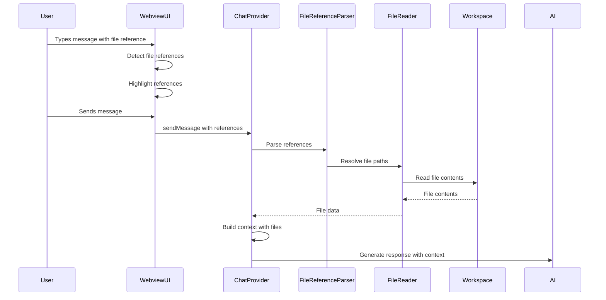

# Design Document: Direct File Reading Feature

## Overview

This design document outlines the implementation of direct file reading capabilities for the Orbit VS Code extension. The feature enables users to explicitly reference files in chat conversations, providing better context control and more accurate AI responses. The implementation extends the existing ChatProvider and webview UI with file reference detection, validation, and content injection into the chat context.

## Architecture

The feature follows a client-server architecture pattern consistent with the existing extension:

1. **Webview UI Layer** (React): Handles user interactions, file reference input, and visual feedback
2. **Extension Host Layer** (TypeScript): Processes file references, validates paths, reads file contents
3. **Message Protocol**: Bidirectional communication between webview and extension using VS Code's webview messaging API

### Component Interaction Flow



## Components and Interfaces

### 1. FileReferenceParser

Responsible for detecting and parsing file references from user messages.

```typescript
interface FileReference {
  raw: string;              // Original text from message
  path: string;             // Resolved file path
  lineRange?: {             // Optional line range
    start: number;
    end: number;
  };
  syntax: 'backtick' | 'hash' | 'plain';  // Detection method
}

class FileReferenceParser {
  /**
   * Parse message text and extract file references
   */
  parse(message: string, workspaceRoot: string): FileReference[];
  
  /**
   * Validate that a file reference points to an existing file
   */
  async validate(reference: FileReference): Promise<boolean>;
  
  /**
   * Resolve relative paths and file names to absolute paths
   */
  async resolvePath(pathOrName: string, workspaceRoot: string): Promise<string | null>;
}
```

### 2. FileContentReader

Handles reading file contents with size limits and line range support.

```typescript
interface FileContent {
  path: string;
  relativePath: string;
  content: string;
  size: number;
  lineCount: number;
  language: string;
  truncated: boolean;
}

interface ReadOptions {
  maxSize?: number;         // Max file size in bytes (default: 500KB)
  lineRange?: {
    start: number;
    end: number;
  };
  encoding?: string;        // Default: 'utf-8'
}

class FileContentReader {
  /**
   * Read file contents with optional line range
   */
  async read(filePath: string, options?: ReadOptions): Promise<FileContent>;
  
  /**
   * Check file size before reading
   */
  async getFileSize(filePath: string): Promise<number>;
  
  /**
   * Read specific line range from file
   */
  async readLines(filePath: string, start: number, end: number): Promise<string>;
}
```

### 3. FileReferenceManager

Manages recent files and provides file picker functionality.

```typescript
interface RecentFile {
  path: string;
  relativePath: string;
  lastUsed: number;
  useCount: number;
}

class FileReferenceManager {
  private recentFiles: Map<string, RecentFile>;  // Per session
  private maxRecentFiles: number = 20;
  
  /**
   * Add file to recent files list
   */
  addRecentFile(filePath: string): void;
  
  /**
   * Get recent files sorted by usage
   */
  getRecentFiles(): RecentFile[];
  
  /**
   * Search workspace files for picker
   */
  async searchFiles(query: string, fileTypes?: string[]): Promise<string[]>;
  
  /**
   * Clear recent files for current session
   */
  clearRecentFiles(): void;
}
```

### 4. ChatProvider Extensions

Extend the existing ChatProvider to handle file references.

```typescript
// Add to ChatProvider class
interface FileContextItem {
  reference: FileReference;
  content: FileContent;
  included: boolean;
}

class ChatProvider {
  private fileReferenceParser: FileReferenceParser;
  private fileContentReader: FileContentReader;
  private fileReferenceManager: FileReferenceManager;
  
  /**
   * Process file references in user message
   */
  private async processFileReferences(
    message: string,
    workspaceRoot: string
  ): Promise<FileContextItem[]>;
  
  /**
   * Build context string with file contents
   */
  private buildFileContext(items: FileContextItem[]): string;
  
  /**
   * Handle file picker request from webview
   */
  private async handleFilePicker(): Promise<void>;
}
```

### 5. Webview UI Components

New React components for file reference UI.

```typescript
// FileReferenceIndicator.tsx
interface FileReferenceIndicatorProps {
  reference: FileReference;
  valid: boolean;
  onRemove?: () => void;
}

// FilePicker.tsx
interface FilePickerProps {
  onSelect: (filePath: string) => void;
  recentFiles: RecentFile[];
}

// FileContextPreview.tsx
interface FileContextPreviewProps {
  files: FileContextItem[];
  onToggle: (index: number) => void;
}
```

## Data Models

### File Reference Syntax

The system supports multiple syntax patterns for file references:

1. **Backtick syntax**: `` `src/extension.ts` ``
2. **Hash syntax**: `#src/extension.ts`
3. **Plain text**: Detected when unique filename matches workspace file

### Line Range Syntax

Line ranges can be specified using colon notation:

- Single line: `src/extension.ts:42`
- Line range: `src/extension.ts:42-58`
- From line to end: `src/extension.ts:42-`

### Message Protocol Extensions

New message types for webview communication:

```typescript
// Extension -> Webview
type ExtensionMessage = 
  | { type: 'fileReferencesDetected'; value: FileReference[] }
  | { type: 'fileValidationResult'; value: { reference: FileReference; valid: boolean }[] }
  | { type: 'fileContextPreview'; value: FileContextItem[] }
  | { type: 'recentFilesUpdated'; value: RecentFile[] };

// Webview -> Extension
type WebviewMessage =
  | { type: 'validateFileReferences'; value: string }
  | { type: 'openFilePicker'; value: { fileTypes?: string[] } }
  | { type: 'insertFileReference'; value: string }
  | { type: 'toggleFileInContext'; value: number };
```

## 
Correctness Properties

*A property is a characteristic or behavior that should hold true across all valid executions of a system—essentially, a formal statement about what the system should do. Properties serve as the bridge between human-readable specifications and machine-verifiable correctness guarantees.*

After analyzing the acceptance criteria, we've identified the following correctness properties that can be validated through property-based testing. Some criteria relate to UI behavior or specific examples that are better suited for unit tests.

### Property 1: File reference detection accuracy
*For any* message string containing file paths in supported syntax (backticks, hash prefix, or plain text), the parser should correctly identify all file references and their positions.
**Validates: Requirements 1.1, 4.1, 4.2**

### Property 2: File existence validation consistency
*For any* file reference, the validation function should return true if and only if the file exists in the workspace.
**Validates: Requirements 1.2**

### Property 3: Valid file content inclusion
*For any* message containing valid file references, the processed context should include the contents of all valid files.
**Validates: Requirements 1.3, 1.5**

### Property 4: Invalid file error notification
*For any* message containing invalid file references, the system should generate appropriate error notifications for each invalid reference.
**Validates: Requirements 1.4**

### Property 5: File picker filtering correctness
*For any* filter query and file type specification, all returned files should match the filter criteria (name contains query AND type matches if specified).
**Validates: Requirements 2.4**

### Property 6: Relative path display consistency
*For any* file in the workspace, when displayed in the file picker or UI, the path should be relative to the workspace root.
**Validates: Requirements 2.5, 2.3**

### Property 7: File metadata accuracy
*For any* referenced file, the displayed size and type information should match the actual file's size and detected language type.
**Validates: Requirements 3.5**

### Property 8: Path separator normalization
*For any* file path using either forward slashes or backslashes, the system should resolve to the same file if it exists.
**Validates: Requirements 4.5**

### Property 9: Relative path resolution
*For any* valid relative path from the workspace root, the system should resolve it to the correct absolute path.
**Validates: Requirements 4.3**

### Property 10: Unique filename resolution
*For any* filename that appears exactly once in the workspace, referencing just the filename should resolve to that file's full path.
**Validates: Requirements 4.4**

### Property 11: Context size limit enforcement
*For any* set of file references, the total context size should not exceed the configured maximum limit.
**Validates: Requirements 5.3**

### Property 12: Partial file reading accuracy
*For any* file and valid line range specification, the returned content should contain exactly the lines specified (inclusive).
**Validates: Requirements 5.5, 6.2**

### Property 13: Line range parsing correctness
*For any* valid line range syntax (single line, range, or open-ended), the parser should extract the correct start and end line numbers.
**Validates: Requirements 6.1, 6.4**

### Property 14: Invalid line range error handling
*For any* invalid line range specification (negative numbers, start > end, out of bounds), the system should return an appropriate error.
**Validates: Requirements 6.3**

### Property 15: Full file reading default
*For any* file reference without a line range specification, the system should read the entire file contents.
**Validates: Requirements 6.5**

### Property 16: Recent files list maintenance
*For any* sequence of file references, the recent files list should contain all referenced files ordered by most recent usage.
**Validates: Requirements 7.1, 7.3**

### Property 17: Recent files ordering
*For any* recent files list, files should be ordered with most recently used first.
**Validates: Requirements 7.2**

### Property 18: Recent files list size limit
*For any* number of file references, the recent files list should never exceed 20 entries, keeping only the most recent.
**Validates: Requirements 7.5**

### Property 19: Recent files persistence
*For any* chat session, after referencing files and creating a new session, the recent files list should still contain the previously referenced files.
**Validates: Requirements 7.4**

## Error Handling

### File System Errors

1. **File Not Found**: When a referenced file doesn't exist
   - Display inline error indicator in the message
   - Show notification with file path
   - Continue processing other valid references

2. **Permission Denied**: When file cannot be read due to permissions
   - Display warning indicator
   - Log error details
   - Suggest checking file permissions

3. **File Too Large**: When file exceeds size limits
   - Show warning at 100KB threshold
   - Require confirmation at 500KB threshold
   - Offer partial reading options

### Parsing Errors

1. **Invalid Line Range**: When line range syntax is malformed
   - Display error message with correct syntax examples
   - Highlight the problematic reference
   - Fall back to reading entire file if user confirms

2. **Ambiguous File Reference**: When filename matches multiple files
   - Show disambiguation UI with all matches
   - Display relative paths for each match
   - Allow user to select intended file

### Context Size Errors

1. **Context Overflow**: When total file contents exceed model limits
   - Calculate total size before reading all files
   - Prioritize files by order of reference
   - Truncate or skip files with user notification
   - Suggest using line ranges to reduce size

## Testing Strategy

### Unit Testing

Unit tests will cover specific examples and edge cases:

- File reference detection with various syntax patterns
- Path resolution for edge cases (root files, nested directories, special characters)
- Line range parsing for boundary values (line 1, last line, single line)
- Recent files list operations (add, remove, clear, persist)
- Error message generation for specific error conditions
- UI component rendering with specific file reference states

### Property-Based Testing

We will use the `fast-check` library (already in package.json) for property-based testing. Each correctness property will be implemented as a property-based test:

- **Minimum iterations**: 100 runs per property test
- **Test tagging**: Each test must include a comment with format: `**Feature: direct-file-reading, Property {number}: {property_text}**`
- **Generators**: Custom generators for file paths, line ranges, message strings with references
- **Shrinking**: Leverage fast-check's shrinking to find minimal failing cases

Example property test structure:

```typescript
/**
 * Feature: direct-file-reading, Property 1: File reference detection accuracy
 * Validates: Requirements 1.1, 4.1, 4.2
 */
test('file reference detection accuracy', () => {
  fc.assert(
    fc.property(
      fc.array(fileReferenceGenerator()),
      fc.string(),
      (references, text) => {
        const message = embedReferencesInText(references, text);
        const detected = parser.parse(message);
        return detected.length === references.length &&
               detected.every((d, i) => d.path === references[i].path);
      }
    ),
    { numRuns: 100 }
  );
});
```

### Integration Testing

Integration tests will verify end-to-end workflows:

- User types message with file reference → file content appears in AI context
- User opens file picker → selects file → reference inserted in input
- User references large file → warning shown → confirmation required
- User references multiple files → all valid files read → context built correctly

## Implementation Phases

### Phase 1: Core File Reference Detection and Reading
- Implement FileReferenceParser with basic syntax support
- Implement FileContentReader with size limits
- Extend ChatProvider to process file references
- Add basic error handling

### Phase 2: UI Integration
- Add file reference highlighting in input area
- Implement file picker component
- Add visual indicators for included files
- Implement file context preview

### Phase 3: Advanced Features
- Add line range support
- Implement recent files tracking
- Add file metadata display
- Implement context size management

### Phase 4: Polish and Optimization
- Improve error messages and user feedback
- Optimize file reading performance
- Add keyboard shortcuts for file picker
- Implement file reference auto-completion

## Performance Considerations

1. **Lazy File Reading**: Only read files when message is sent, not during typing
2. **Caching**: Cache file contents for recently referenced files (with invalidation on file change)
3. **Debouncing**: Debounce file reference validation during typing
4. **Streaming**: For large files, consider streaming content instead of loading entirely into memory
5. **Worker Threads**: Consider using worker threads for file reading to avoid blocking the extension host

## Security Considerations

1. **Path Traversal**: Validate all file paths to prevent access outside workspace
2. **Symlink Handling**: Resolve symlinks and validate resolved paths are within workspace
3. **Binary Files**: Detect and reject binary files to prevent encoding issues
4. **Size Limits**: Enforce strict size limits to prevent memory exhaustion
5. **Rate Limiting**: Limit number of files that can be referenced in a single message

## Accessibility

1. **Screen Reader Support**: Ensure file references are announced with proper labels
2. **Keyboard Navigation**: Full keyboard support for file picker and reference management
3. **High Contrast**: File reference indicators must be visible in high contrast themes
4. **Focus Management**: Proper focus handling when file picker opens/closes
