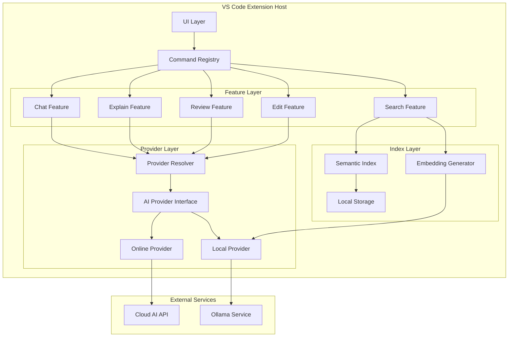
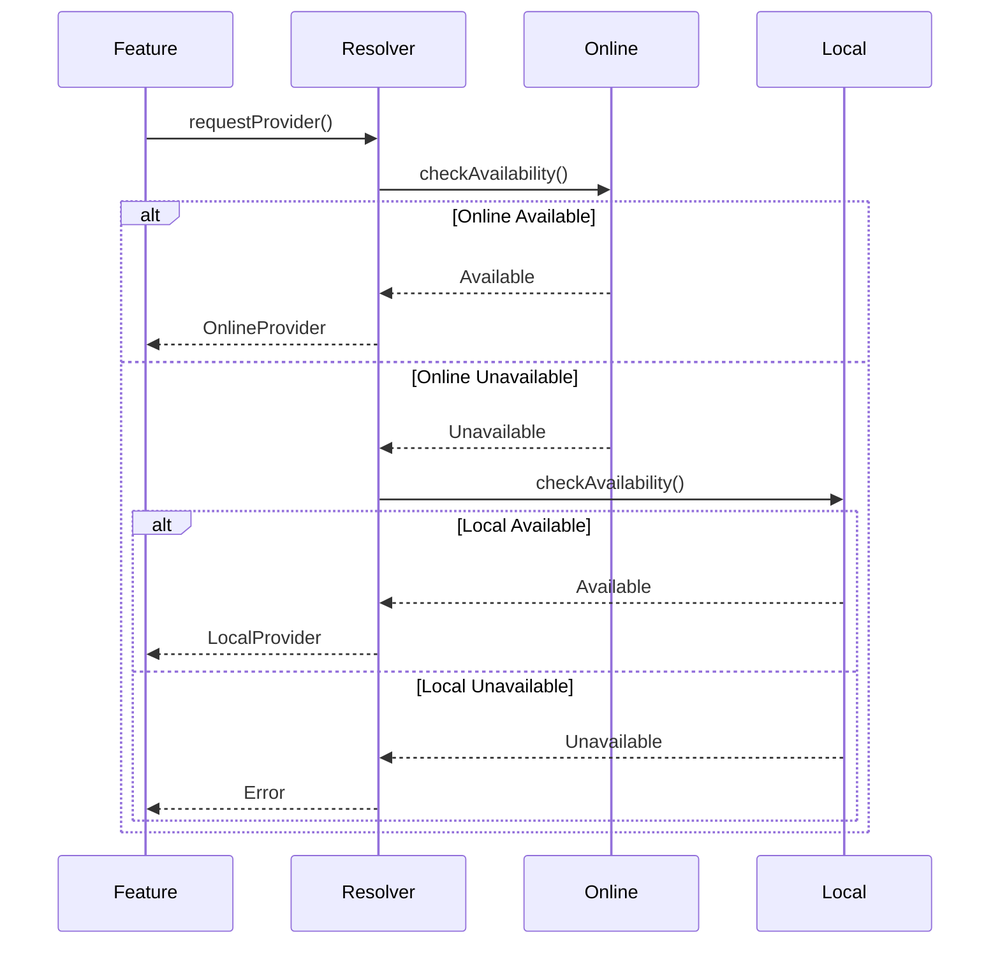

# Design Document: Orbit VS Code Extension

## Overview

Orbit is a VS Code extension that provides AI-powered coding assistance with seamless online/offline operation. The architecture centers on a provider abstraction layer that enables automatic failover between cloud-based and local AI services without disrupting user workflows.

The system consists of:
- **Provider Layer**: Abstraction over Online (Cloud API) and Local (Ollama) AI providers
- **Feature Layer**: Five core commands (Chat, Explain, Search, Review, Edit)
- **UI Layer**: Sidebar chat interface and command palette integration
- **Index Layer**: Local semantic search using embeddings

Key design principles:
- Single unified interface regardless of connectivity
- Automatic provider selection with graceful degradation
- Explicit user approval for all code modifications
- No blocking dialogs or mode-switching UI

## Architecture

### High-Level Component Diagram



### Provider Resolution Flow



## Components and Interfaces

### 1. AI Provider Interface

The core abstraction that all providers must implement:

```typescript
interface AIProvider {
  // Provider identification
  readonly name: string;
  readonly type: 'online' | 'local';
  
  // Health check
  isAvailable(): Promise<boolean>;
  
  // Core AI operations
  chat(messages: Message[], context: Context): Promise<ChatResponse>;
  explain(code: string, context: Context): Promise<string>;
  review(code: string, context: Context): Promise<ReviewComment[]>;
  generateDiff(code: string, instruction: string, context: Context): Promise<UnifiedDiff>;
}

interface Message {
  role: 'user' | 'assistant' | 'system';
  content: string;
}

interface Context {
  activeFile?: string;
  selection?: string;
  language?: string;
}

interface ChatResponse {
  content: string;
  model: string;
  tokensUsed?: number;
}

interface ReviewComment {
  line: number;
  message: string;
  category: 'readability' | 'syntax' | 'best-practice' | 'improvement';
}

interface UnifiedDiff {
  original: string;
  modified: string;
  diff: string; // Unified diff format
}
```

### 2. Provider Resolver

Manages provider selection and failover:

```typescript
class ProviderResolver {
  private onlineProvider: OnlineProvider;
  private localProvider: LocalProvider;
  private currentProvider: AIProvider | null = null;
  
  async getProvider(): Promise<AIProvider> {
    // Check online first
    if (await this.onlineProvider.isAvailable()) {
      this.currentProvider = this.onlineProvider;
      return this.onlineProvider;
    }
    
    // Fallback to local
    if (await this.localProvider.isAvailable()) {
      this.currentProvider = this.localProvider;
      return this.localProvider;
    }
    
    throw new Error('No AI provider available');
  }
  
  getCurrentProvider(): AIProvider | null {
    return this.currentProvider;
  }
  
  async checkHealth(): Promise<ProviderHealth> {
    return {
      online: await this.onlineProvider.isAvailable(),
      local: await this.localProvider.isAvailable(),
      active: this.currentProvider?.name || 'none'
    };
  }
}

interface ProviderHealth {
  online: boolean;
  local: boolean;
  active: string;
}
```

### 3. Online Provider Implementation

Connects to cloud AI API:

```typescript
class OnlineProvider implements AIProvider {
  readonly name = 'Cloud AI';
  readonly type = 'online';
  
  private apiEndpoint: string;
  private apiKey: string;
  private timeout = 30000; // 30 seconds
  
  async isAvailable(): Promise<boolean> {
    try {
      const response = await fetch(`${this.apiEndpoint}/health`, {
        method: 'GET',
        timeout: 2000
      });
      return response.ok;
    } catch {
      return false;
    }
  }
  
  async chat(messages: Message[], context: Context): Promise<ChatResponse> {
    const response = await fetch(`${this.apiEndpoint}/chat`, {
      method: 'POST',
      headers: {
        'Authorization': `Bearer ${this.apiKey}`,
        'Content-Type': 'application/json'
      },
      body: JSON.stringify({
        messages,
        context,
        model: 'gpt-4' // or configurable
      }),
      timeout: this.timeout
    });
    
    return await response.json();
  }
  
  // Similar implementations for explain, review, generateDiff
}
```

### 4. Local Provider Implementation

Connects to Ollama:

```typescript
class LocalProvider implements AIProvider {
  readonly name = 'Ollama';
  readonly type = 'local';
  
  private ollamaEndpoint = 'http://localhost:11434';
  private model = 'codellama'; // or configurable
  
  async isAvailable(): Promise<boolean> {
    try {
      const response = await fetch(`${this.ollamaEndpoint}/api/tags`, {
        timeout: 1000
      });
      return response.ok;
    } catch {
      return false;
    }
  }
  
  async chat(messages: Message[], context: Context): Promise<ChatResponse> {
    // Convert messages to Ollama format
    const prompt = this.formatMessages(messages, context);
    
    const response = await fetch(`${this.ollamaEndpoint}/api/generate`, {
      method: 'POST',
      headers: { 'Content-Type': 'application/json' },
      body: JSON.stringify({
        model: this.model,
        prompt,
        stream: false
      })
    });
    
    const data = await response.json();
    return {
      content: data.response,
      model: this.model
    };
  }
  
  private formatMessages(messages: Message[], context: Context): string {
    let prompt = '';
    
    if (context.activeFile) {
      prompt += `File: ${context.activeFile}\n\n`;
    }
    
    if (context.selection) {
      prompt += `Selected code:\n${context.selection}\n\n`;
    }
    
    for (const msg of messages) {
      prompt += `${msg.role}: ${msg.content}\n`;
    }
    
    return prompt;
  }
  
  // Similar implementations for explain, review, generateDiff
}
```

### 5. Feature Implementations

Each feature uses the provider resolver:

```typescript
class ChatFeature {
  constructor(private resolver: ProviderResolver) {}
  
  async sendMessage(message: string, context: Context): Promise<ChatResponse> {
    const provider = await this.resolver.getProvider();
    const messages = this.getChatHistory();
    messages.push({ role: 'user', content: message });
    
    return await provider.chat(messages, context);
  }
  
  private getChatHistory(): Message[] {
    // Retrieve from chat state
    return [];
  }
}

class ExplainFeature {
  constructor(private resolver: ProviderResolver) {}
  
  async explain(code: string, context: Context): Promise<string> {
    const provider = await this.resolver.getProvider();
    return await provider.explain(code, context);
  }
}

class ReviewFeature {
  constructor(private resolver: ProviderResolver) {}
  
  async review(code: string, context: Context): Promise<ReviewComment[]> {
    const provider = await this.resolver.getProvider();
    return await provider.review(code, context);
  }
}

class EditFeature {
  constructor(private resolver: ProviderResolver) {}
  
  async generateEdit(code: string, instruction: string, context: Context): Promise<UnifiedDiff> {
    const provider = await this.resolver.getProvider();
    return await provider.generateDiff(code, instruction, context);
  }
  
  async applyDiff(diff: UnifiedDiff, document: TextDocument): Promise<void> {
    // Parse diff and apply to document
    // This requires explicit user approval via UI
  }
}
```

### 6. Semantic Search Implementation

Independent of provider system, uses local embeddings:

```typescript
class SemanticSearchFeature {
  private index: SemanticIndex;
  private embedder: EmbeddingGenerator;
  
  constructor(private localProvider: LocalProvider) {
    this.embedder = new EmbeddingGenerator(localProvider);
    this.index = new SemanticIndex();
  }
  
  async buildIndex(workspace: WorkspaceFolder): Promise<void> {
    const files = await this.getCodeFiles(workspace);
    
    for (const file of files) {
      const content = await fs.readFile(file, 'utf-8');
      const chunks = this.chunkCode(content);
      
      for (const chunk of chunks) {
        const embedding = await this.embedder.generate(chunk);
        this.index.add({
          file,
          chunk,
          embedding
        });
      }
    }
    
    await this.index.save();
  }
  
  async search(query: string, topK: number = 10): Promise<SearchResult[]> {
    const queryEmbedding = await this.embedder.generate(query);
    return this.index.search(queryEmbedding, topK);
  }
  
  private chunkCode(content: string): string[] {
    // Split code into semantic chunks (functions, classes, etc.)
    return [];
  }
  
  private async getCodeFiles(workspace: WorkspaceFolder): Promise<string[]> {
    // Get all code files, respecting .gitignore
    return [];
  }
}

interface SearchResult {
  file: string;
  chunk: string;
  score: number;
}

class EmbeddingGenerator {
  constructor(private provider: LocalProvider) {}
  
  async generate(text: string): Promise<number[]> {
    // Use local provider to generate embeddings
    // Ollama supports embedding models
    return [];
  }
}

class SemanticIndex {
  private entries: IndexEntry[] = [];
  
  add(entry: IndexEntry): void {
    this.entries.push(entry);
  }
  
  search(queryEmbedding: number[], topK: number): SearchResult[] {
    // Calculate cosine similarity
    const results = this.entries.map(entry => ({
      file: entry.file,
      chunk: entry.chunk,
      score: this.cosineSimilarity(queryEmbedding, entry.embedding)
    }));
    
    // Sort by score and return top K
    return results.sort((a, b) => b.score - a.score).slice(0, topK);
  }
  
  private cosineSimilarity(a: number[], b: number[]): number {
    const dotProduct = a.reduce((sum, val, i) => sum + val * b[i], 0);
    const magA = Math.sqrt(a.reduce((sum, val) => sum + val * val, 0));
    const magB = Math.sqrt(b.reduce((sum, val) => sum + val * val, 0));
    return dotProduct / (magA * magB);
  }
  
  async save(): Promise<void> {
    // Persist to local storage
  }
  
  async load(): Promise<void> {
    // Load from local storage
  }
}

interface IndexEntry {
  file: string;
  chunk: string;
  embedding: number[];
}
```

## Data Models

### Chat State

```typescript
interface ChatState {
  messages: Message[];
  context: Context | null;
  activeProvider: string;
}
```

### Extension State

```typescript
interface ExtensionState {
  providerHealth: ProviderHealth;
  indexStatus: IndexStatus;
  configuration: Configuration;
}

interface IndexStatus {
  built: boolean;
  lastUpdated: Date | null;
  fileCount: number;
}

interface Configuration {
  onlineApiEndpoint: string;
  onlineApiKey: string;
  ollamaEndpoint: string;
  ollamaModel: string;
  preferOnline: boolean;
}
```

### Review Output

```typescript
interface ReviewOutput {
  file: string;
  comments: ReviewComment[];
  provider: string;
  timestamp: Date;
}
```

### Diff Application

```typescript
interface DiffApplication {
  original: string;
  modified: string;
  diff: UnifiedDiff;
  approved: boolean;
  appliedAt: Date | null;
}
```

## Correctness Properties

*A property is a characteristic or behavior that should hold true across all valid executions of a system—essentially, a formal statement about what the system should do. Properties serve as the bridge between human-readable specifications and machine-verifiable correctness guarantees.*


### Property 1: Provider Selection Prioritization
*For any* system state where both Online_Provider and Local_Provider are available, the Provider_Resolver should select Online_Provider as the active provider.
**Validates: Requirements 1.2**

### Property 2: Provider Failover
*For any* system state where Online_Provider is unavailable and Local_Provider is available, the Provider_Resolver should automatically select Local_Provider as the active provider.
**Validates: Requirements 1.3, 8.2**

### Property 3: Provider Selection Performance
*For any* provider availability state, the Provider_Resolver should complete provider selection and return a result within 500ms of invocation.
**Validates: Requirements 1.6**

### Property 4: Command Behavior Consistency
*For any* command invocation with identical inputs and context, the command should produce structurally equivalent output regardless of which provider is active (even if content quality differs).
**Validates: Requirements 1.5**

### Property 5: Chat Context Inclusion
*For any* chat message sent with an active file and selection, the context passed to the AI provider should include both the active file content and the selected text.
**Validates: Requirements 2.2**

### Property 6: Chat Always Responds
*For any* chat message and any provider availability state, the chat feature should return a response (either successful AI response or error message) without throwing unhandled exceptions.
**Validates: Requirements 2.5**

### Property 7: No Intrusive UI During Transitions
*For any* provider transition (online to local or local to online), the system should not invoke any dialog or popup notification APIs.
**Validates: Requirements 2.7, 8.4, 8.5**

### Property 8: Explanation Generation
*For any* code selection, the explain feature should return a non-empty explanation string within 10 seconds.
**Validates: Requirements 3.2, 3.5**

### Property 9: Explain Fallback to Full File
*For any* explain command invocation where no code is selected, the system should pass the entire active file content to the provider.
**Validates: Requirements 3.6**

### Property 10: Search Returns Top-K Results
*For any* search query on a non-empty index, the search feature should return at most K results (where K is the requested limit), sorted by relevance score in descending order.
**Validates: Requirements 4.3**

### Property 11: Search Works Offline
*For any* search query, the search feature should complete successfully using only the local Semantic_Index without making any network requests.
**Validates: Requirements 4.4**

### Property 12: Search Does Not Navigate
*For any* search operation, the active editor document and cursor position should remain unchanged after the search completes.
**Validates: Requirements 4.6**

### Property 13: Search Does Not Modify Code
*For any* search operation, no document modifications should occur as a result of the search.
**Validates: Requirements 4.7**

### Property 14: Review Scope Limited to Active File
*For any* review operation, the code passed to the provider should contain only the currently active file content, not content from other files.
**Validates: Requirements 5.2, 5.6**

### Property 15: Review Output Has No Severity
*For any* review operation result, the review comments should not contain severity level fields or classifications.
**Validates: Requirements 5.7**

### Property 16: Edit Generates Valid Diff
*For any* edit instruction and code input, the edit feature should generate output in valid unified diff format.
**Validates: Requirements 6.2**

### Property 17: Code Modification Safety
*For any* operation that could modify code (edit, review, etc.), no document changes should be applied without an explicit approval action from the user.
**Validates: Requirements 6.3, 6.7, 10.1, 10.4**

### Property 18: Diff Requires Approval
*For any* generated unified diff, the apply operation should require an explicit approval parameter to be set to true before making any document modifications.
**Validates: Requirements 6.4**

### Property 19: Health Check Performance
*For any* health check invocation, the system should return complete health status information within 2 seconds.
**Validates: Requirements 7.6**

### Property 20: Commands Available During Network Loss
*For any* network connectivity state (online or offline), all registered commands should remain callable and should not be unregistered or disabled.
**Validates: Requirements 8.1, 9.5**

### Property 21: Provider Recovery on Reconnection
*For any* system state where network connectivity is restored after being lost, the Provider_Resolver should automatically switch back to Online_Provider if it becomes available.
**Validates: Requirements 8.3**

### Property 22: Command Interface Consistency
*For any* provider state, the set of registered command names and their invocation signatures should remain identical.
**Validates: Requirements 9.1, 9.2**

### Property 23: Change Presentation Before Application
*For any* code change generation operation, the proposed changes should be returned to the user interface before any document modification occurs.
**Validates: Requirements 10.2**

### Property 24: Modification Audit Trail
*For any* code modification that is applied, a log entry should be created containing the timestamp, user action, and modification details.
**Validates: Requirements 10.5**

## Error Handling

### Provider Unavailability

When both providers are unavailable:
- Commands should return user-friendly error messages
- Error messages should indicate which providers were checked
- Error messages should suggest remediation steps (check Ollama, check network, etc.)
- No exceptions should propagate to VS Code's error handler

### Network Timeouts

When network requests timeout:
- Online provider should fail fast (2 second timeout for health checks, 30 seconds for operations)
- System should automatically fall back to local provider
- User should see subtle status indicator update
- No blocking dialogs or interruptions

### Ollama Service Down

When Ollama is not running:
- Local provider availability check should return false quickly (1 second timeout)
- If online provider is available, operations continue normally
- If both providers unavailable, show clear error with setup instructions
- Health check should indicate Ollama status

### Invalid API Keys

When cloud API key is invalid or expired:
- Online provider should detect auth failures
- System should fall back to local provider
- Error should be logged for debugging
- User should see status indicator showing local-only mode

### Malformed Responses

When providers return unexpected response formats:
- Parse errors should be caught and logged
- User should see generic error message
- Operation should not crash the extension
- Retry logic should not apply (fail fast)

### Index Corruption

When semantic index is corrupted or incompatible:
- Search feature should detect corruption on load
- System should offer to rebuild index
- Search should gracefully fail with error message until rebuilt
- Other features should continue working normally

## Testing Strategy

### Unit Testing

Unit tests will verify specific examples and edge cases:

**Provider Layer:**
- Online provider connects to correct endpoint with correct headers
- Local provider formats messages correctly for Ollama
- Provider resolver returns online when both available
- Provider resolver returns local when only local available
- Provider resolver throws error when none available
- Health check returns correct status for each provider state

**Feature Layer:**
- Chat feature appends messages to history correctly
- Explain feature handles empty selection by using full file
- Search feature returns empty array for empty index
- Review feature formats comments correctly
- Edit feature parses unified diff format correctly

**Index Layer:**
- Cosine similarity calculation is correct for known vectors
- Index returns results sorted by score
- Index persists and loads correctly
- Embedding generator handles empty strings

**Edge Cases:**
- Empty file content
- Very large files (>1MB)
- Special characters in code
- Binary files
- Network timeout scenarios
- Concurrent provider requests

### Property-Based Testing

Property tests will verify universal correctness properties across many generated inputs. Each test will run a minimum of 100 iterations with randomized inputs.

**Testing Framework:** We will use `fast-check` for TypeScript property-based testing.

**Test Configuration:**
```typescript
import fc from 'fast-check';

// All property tests should use this configuration
const testConfig = {
  numRuns: 100,  // Minimum iterations
  verbose: true,  // Show counterexamples
};
```

**Property Test Implementation:**

Each correctness property from the design will be implemented as a property-based test:

1. **Property 1-3 (Provider Selection):** Generate random provider availability states and verify selection logic
2. **Property 4 (Command Consistency):** Generate random commands and contexts, verify output structure consistency
3. **Property 5-6 (Chat):** Generate random messages and contexts, verify context inclusion and response presence
4. **Property 7 (No Intrusive UI):** Mock UI APIs, generate provider transitions, verify no dialog calls
5. **Property 8-9 (Explain):** Generate random code strings and selections, verify explanations and fallback
6. **Property 10-13 (Search):** Generate random queries and indices, verify result count, offline operation, and no side effects
7. **Property 14-15 (Review):** Generate random code, verify scope and output format
8. **Property 16-18 (Edit):** Generate random edit instructions, verify diff format and approval requirements
9. **Property 19 (Health Check):** Generate random system states, verify timing
10. **Property 20-22 (Availability):** Generate random network states, verify command availability and consistency
11. **Property 23-24 (Safety):** Generate random modifications, verify presentation and logging

**Generators:**

Custom generators will be created for:
- Provider availability states
- Code snippets (valid TypeScript/JavaScript/Python)
- Chat messages and contexts
- Search queries
- Edit instructions
- Network connectivity states

**Example Property Test:**
```typescript
describe('Property 1: Provider Selection Prioritization', () => {
  it('should select online provider when both available', () => {
    // Feature: orbit-vscode-extension, Property 1: Provider Selection Prioritization
    fc.assert(
      fc.property(
        fc.record({
          onlineAvailable: fc.constant(true),
          localAvailable: fc.boolean(),
        }),
        async (state) => {
          const resolver = new ProviderResolver(
            mockOnlineProvider(state.onlineAvailable),
            mockLocalProvider(state.localAvailable)
          );
          
          const provider = await resolver.getProvider();
          expect(provider.type).toBe('online');
        }
      ),
      testConfig
    );
  });
});
```

### Integration Testing

Integration tests will verify end-to-end workflows:
- User sends chat message → provider called → response displayed
- User invokes explain → context gathered → explanation returned
- User searches codebase → index queried → results displayed
- User requests review → file analyzed → comments shown
- User requests edit → diff generated → user approves → changes applied
- Network disconnects → provider switches → commands still work
- Ollama starts/stops → provider availability updates

### Manual Testing Scenarios

Some aspects require manual verification:
- UI layout and visual consistency
- Status indicator subtlety and placement
- Explanation quality comparison (online vs offline)
- Review comment usefulness
- Diff readability
- Overall user experience flow

### Performance Testing

Performance tests will verify:
- Provider selection completes within 500ms
- Explanations complete within 10 seconds
- Health checks complete within 2 seconds
- Index search completes within 1 second for typical queries
- Memory usage remains reasonable with large indices

### Continuous Testing

- All tests run on every commit
- Property tests run with 100 iterations in CI
- Integration tests run against real Ollama instance
- Performance tests run weekly with benchmarking
